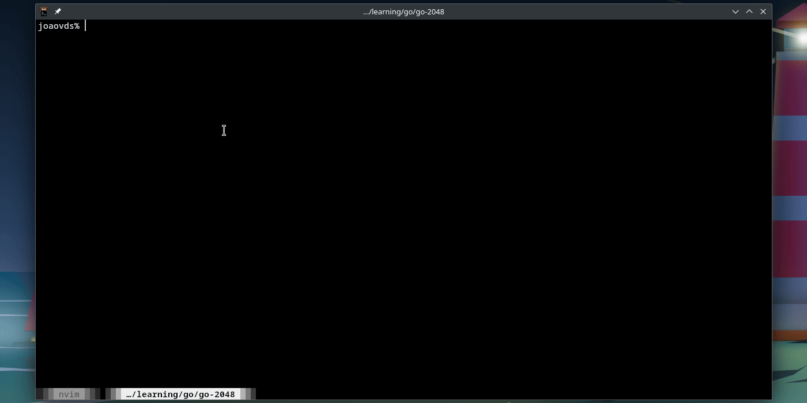

# 2048 Game 🎮

2048 terminal game written in Go (Golang) 🎮

## Technology

- [Go (Golang)](https://go.dev/)
- [Docker](https://www.docker.com/)

<div style="display: flex;">
    
</div>

<div style="display: flex;">
    
</div>

## Prerequisites

Make sure you have the following installed on your machine:

- Go 1.22.2 or greater

## Installation and execution

1. Clone this repository to your local environment.
2. Change to the project directory:

    ```bash
    cd go-2048
    ```

3. Install the Go dependencies:

    ```bash
    go mod tidy
    ```

4. Execute

    ```bash
    go run cmd/main.go
    ```

## Contributing

If you want to contribute to this project, feel free to open an issue or send a pull request
